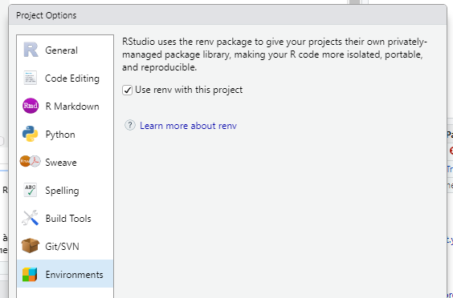
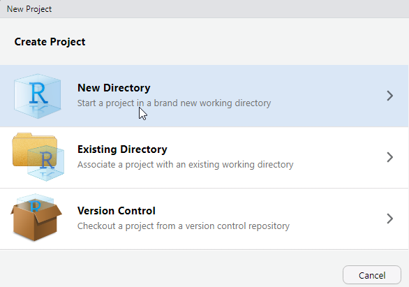

# Bien commencer


## Créer un projet sous Rstudio pour vous permettre de recenser vos travaux.

Pourquoi travailler avec les projets Rstudio plutôt que les scripts R ?

- Cela permet la portabilité : le répertoire de travail par défaut d'un projet est le répertoire où est ce projet. Si vous transmettez celui-ci à un collègue, le fait de lancer un programme ne dépend pas de l'arborescence de votre machine.

> **Fini les `setwd("chemin/qui/marche/uniquement/sur/mon/poste")` !** 


- Toujours sur la portabilité, un projet peut être utilisé avec un package comme `renv` qui permet d'internaliser au sein du projet l'ensemble des packages utilisés dans la version utilisée. Cela permet donc à votre collègue à qui vous passez votre projet de ne pas avoir à les installer dans la même version, et si vous mettez à jour votre environnement R, votre projet restera toujours avec les versions des packages avec lesquelles vous l'avez fait tourner à l'époque. Cela évite d'avoir à subir les effets d'une mise à jour d'un package qui casserait votre code.

`renv` est intégré à Rstudio. Pour activer `renv` sur un projet, aller dans `Tools / Project Options -> Environment`

{#id .class width=500}

[En savoir plus sur renv](https://rstudio.github.io/renv/)

- Cela permet de se forcer à travailler en mode projet : on intègre à un seul endroit tous ce qui est lié à ce projet : données brutes, données retravaillées, scripts, illustrations, documentations, publications... et donc y compris packages avec `packrat` ou `renv`.

- On peut travailler sur plusieurs projets en même temps, Rstudio ouvre alors autant de sessions que de projets.

- Les projets Rstudio intègrent une interface avec les outils de gestion de version `git` et `svn.` Cela veut dire que vous pouvez versionner votre projet et l'héberger simplement comme répertoire sur des plateformes de gestion de code (forges) telle que `github` ou `gitlab`.

**Pour créer un projet : **

- Cliquez sur *Project* en haut à droite puis *New Project*.
{#id .class width=500}


- Cliquez sur *New Directory*.
{#id .class width=500}

## Désactiver les options de sauvegarde automatique de Rstudio

Votre code doit être reproductible depuis vos données en entrée vers votre résultat. Pour cela, il est fortement déconseillé de sauvegarder quoique ce soit dans le fichier `.RData` de sauvegarde par défaut. 

Pour cela, aller dans *Tools -> Global Options...* et ensuite conformez vous à ceci :


## Intégrer vos données

Une bonne pratique est de créer un sous répertoire `/extdata` pour stocker les données sur lesquelles vous aurez à travailler et un dossier `/data` pour stocker les données après préparation. 

Vous pouvez le faire de l'explorateur de fichier de votre système d'exploitation ou directement à partir de l'explorateur de fichier de RStudio.
{#id .class width=500}

Si par la suite vous souhaitez avoir des exemples de bonnes pratiques sur comment structurer vos données, vous pouvez vous référer au [chapitre data](http://r-pkgs.had.co.nz/data.html) du livre d'Hadley Wickham sur la construction de package R (tout package R étant aussi un projet !)

## Créer votre arborescence de projet

- Créer un répertoire `/src` où vous mettrez vos scripts R.

- Créer un répertoire `/figures` où vous mettrez vos illustrations issues de R.

## Utilisation du package savoirfR

Pour faciliter le déroulé de ce module, l'ensemble des exercices (énoncés, corrigés et données) ont été intégrés à un package réalisé par le groupe de référent R: savoirfR

```{r savoirfR, eval = FALSE}
remotes::install_github("MTES-MCT/savoirfR")
```

Pour l'utiliser, il suffit de créer un nouveau projet dans un nouveau répertoire, en sélectionnant le "Project Type" **Exercice Parcours R MTES-MCT**.

{#id .class width=500}

Remplissez et sélectionnez le module suivi.

{#id .class width=500} 


## Activer les packages nécessaires

Commencez par rajouter un script dans le répertoire `/src` à votre projet qui commencera par : 

- activez l'ensemble des packages nécessaires,

- chargez les données dont vous aurez besoin.

```{r all_packages}

library(cowplot)
library(cartogram)
library(DT)
library(ggspatial)
library(glue)
library(htmlwidgets)
library(knitr)
library(kableExtra)
library(leaflet)
library(lwgeom)
library(mapview)
library(patchwork)
library(rmapshaper)
library(RPostgres)
library(scales)
library(sf)
library(spData)
library(tmap)
library(tmaptools)
library(tidyverse) # comprend ggplot2, stringr, purrr, readr
library(variousdata)
library(viridis)

load("extdata/admin_express.RData")
load("extdata/sirene.RData")
prefectures <- read_csv2("extdata/prefecture.csv")

```

## Bien structurer ses projets data

Plusieurs documents peuvent vous inspirer sur la structuration de vos projets data par la suite.

En voici quelques uns : 

- https://github.com/pavopax/new-project-template
- https://nicercode.github.io/blog/2013-04-05-projects/
- https://www.inwt-statistics.com/read-blog/a-meaningful-file-structure-for-r-projects.html
- http://projecttemplate.net/architecture.html

A partir du moment où quelques grands principes sont respectés (un répertoire pour les données brutes en lecture seule par exemple), le reste est surtout une question d'attirance plus forte pour l'une ou l'autre solution. L'important est de vous tenir ensuite à garder toujours la même structure dans vos projets afin de vous y retrouver plus simplement.
