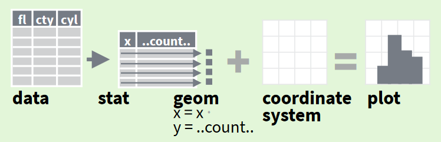

# (PART) Créer des cartes sous R {-}

# Créer des cartes statiques avec {ggplot2} {#creer-des-cartes-avec-ggplot2}   

## Librairies

Dans ce chapitre, nous allons utiliser les librairies suivantes :

```{r pkg_chap_12_ggplot, message=FALSE, warning=FALSE}
# CRAN
library(cowplot)
library(ggspatial)
library(sf)
library(tidyverse) #comprend ggplot2

# Github
library(COGiter)    # remotes::install_github("MaelTheuliere/COGiter")
library(gouvdown)   # remotes::install_github("spyrales/gouvdown")

# Gitlab-forge
library(mapfactory) # remotes::install_gitlab("dreal-pdl/csd/mapfactory", host = "gitlab-forge.din.developpement-durable.gouv.fr")
```

```{r, eval=TRUE, echo=FALSE}
theme_set(theme_minimal())
```

## Introduction : les cartes statiques en R

<br>
Il existe de nombreuses manières de visualiser des données géographiques dans R. 
Des instructions très concises suffisent pour disposer d'un premier aperçu. 
Prenons l'exemple de notre couche régionale issue de COGiter.

```{r intro_creer_carte, message=FALSE, warning=FALSE}
library(COGiter)
library(sf)
```

En utilisant la fonction `plot()` basique de R sur un objet sf, R nous propose un rapide aperçu de la couche et de ses attributs :
```{r}
plot(COGiter::regions_geo)
```

Le package `{mapview}` permet également d'afficher un aperçu de couche très rapidement, posé sur un fond de carte Open street map.
```{r}
library(mapview) 
mapview(x = COGiter::regions_geo)
```

Le résultat est un widget html, explorable, zoomable, cliquable. 
Bien que conçu principalement pour faciliter l'exploration de données spatiales, `{mapview}` permet de personnaliser la mise en plage, d'empiler les couches...
Ce ne sera pas vu lors de la formation, mais tout est très bien expliqué dans l'aide `?mapview()` et sur le [site de présentation du package](https://r-spatial.github.io/mapview/){target="_blank"}, notamment sur la [vignette de démarrage](https://r-spatial.github.io/mapview/articles/mapview_01-basics.html){target="_blank"}. 

Pour mettre en page des cartes, 3 packages se distinguent :   

- `{ggplot2}`, 
- `{tmap}`,  
- et `{mapsf}` (successeur de `{cartography}`).

`{ggplot2}` est un package du tidyverse, qui propose une syntaxe cohérente entre dataviz et cartoviz. Il dispose de templates à la Marque Etat, raison pour laquelle son utilisation est à privilégier au sein du pôle ministériel.  

`{tmap}` a longtemps été plus complet et plus simple que ggplot2. 
Il constituait un incontournable. 
Ce n'est plus le cas désormais. 
Son utilisation est détaillée en annexe pour mémoire.   

Le [package `{mapsf}`](https://riatelab.github.io/mapsf/){target="_blank"} a été développé par Timothé Giraud du CNRS. 
Ses fonctionnalités sont assez complètes et la prise en main est plutôt simple, pour des rendus graphiques très aboutis. 
De plus, le package est relativement léger. 
Un [support de cours](https://rcarto.github.io/cartographie_avec_r/mapsf.html#ref-R-mapsf){target="_blank"} et une [feuille de triche](https://raw.githubusercontent.com/riatelab/mapsf/master/vignettes/web_only/img/mapsf_cheatsheet.pdf){target="_blank"} facilitent son appropriation. 
Comme l'utilisation de `{ggplot2}` est à privilégier au sein du pôle ministériel, ce package ne sera pas présenté lors de la formation.


## Quelques rappels sur `{ggplot2}` issus du [module 5 sur la datavisualisation](https://mtes-mct.github.io/parcours_r_module_datavisualisation/){target="_blank"}

`{ggplot2}` est un package de visualisation de données qui dispose de templates (thèmes, palettes) à la Marque Etat grâce au package `{gouvdown}`, créé par la communauté d'agents de l'Etat [Spyrales](https://www.spyrales.fr/){target="_blank"}.

{#id .class width=500}


- [ggplot 2](http://ggplot2.tidyverse.org/){target="_blank"} a été créé par Hadley Wickham et Winston Chang pour implémenter dans R la vision développée par Leland Wilkinson dans  [The Grammar of Graphics (Statistics and Computing)](https://www.amazon.com/Grammar-Graphics-Statistics-Computing/dp/0387245448/ref=as_li_ss_tl?ie=UTF8&qid=1477928463&sr=8-1&keywords=the+grammar+of+graphics&linkCode=sl1&tag=ggplot2-20&linkId=f0130e557161b83fbe97ba0e9175c431){target="_blank"} de la conception de graphiques.

- Le but est de fournir une approche unique pour produire quasiment **toute valorisation graphique** de données que l'on peut trouver dans des revues scientifiques, les journaux, dans l'analyse statistique ou la data visualisation.

- Ce package aujourd'hui s'inscrit dans R dans le **framework Tidyverse** qui propose une approche cohérente sur l'ensemble de la chaîne de vie de la donnée : importation, préparation des données, analyse et valorisation.

{#id .class width=800}  


### `{ggplot2}` : les concepts clefs

Pour construire un graphique avec `{ggplot2}` il faut lui déclarer plusieurs éléments : 

- **la donnée à représenter** : ggplot2 permet de travailler sur des vecteurs, des dataframes, des tibbles, ou des données spatiales ;

- le **mapping** : on définit dans l'aesthetic (ou aes) le **mapping**, c'est à dire ce que l'on veut représenter qui **dépend des variables** (quelle variable sur l'axe x, sur l'axe y, quelle variable pour définir une graduation de couleurs...), par exemple : 
  + `x`, `y` : pour les variables qui seront représentées selon les axes x et y ;
  + `colour` : pour la variable qui sera représentée par la couleur (contour),  
  + `fill` : pour la variable qui sera représentée par la couleur de remplissage ;
  + `shape` : pour la variable qui sera représentée par la forme du point,
  + `size` : pour la variable qui sera représentée par la taille du point ou de la ligne,
  + `alpha` : pour la variable qui sera représentée par la transparence du remplissage.

- les autres **paramètres** : on définit en dehors de l'aesthetic les autres paramètres graphiques constants (par exemple : je veux que toutes mes lignes soient rouges ou de taille 2 pixels) ;

- le **layer (forme ou calque géométrique)** : on définit sous quelle représentation graphique on représente les paramètres précédents (nuages de points, diagramme barres,...). Sous ggplot, ces fonctions sont de la forme `geom_XX()` ;

- le **système de coordonnées** : on définit quel type de système de coordonnées (polaire, cartésien...) on souhaite utiliser pour visualiser nos données. Par défaut ggplot utilise les coordonnées x, y cartésiennes. Si besoin de changer, on spécifie le système de coordonnées à l'aide d'une fonction de type `coord_XX`.

L'écriture type d'un graphique ggplot sera donc : 

```{r, echo=TRUE, eval=FALSE}
ggplot(data = <DATA>) + 
  <CALQUE_GEO>(mapping = aes(<MAPPINGS>), ...=<PARAMS>)
```

Voici un exemple appliqué au jeu de données d'exemple de R `iris` :

```{r, echo=FALSE}
glimpse(iris)
```


```{r, echo=TRUE}
ggplot(data = iris) + 
  geom_point(mapping = aes(x = Sepal.Length, y = Petal.Length, color = Species))
```

Les fonctions de création de calques `geom_XX` incluent une transformation statistique par défaut (identité, décompte, quantile, classification...) grâce à leur paramètre "stat", qu'il est possible de modifier au besoin.  
Par exemple la fonction `geom_bar()` est associé par défaut à la transformation `stat_count()` qui décompte les observations. 

```{r, echo=TRUE, fig.asp=0.5, fig.height=3}
ggplot(data = iris) + 
  geom_bar(mapping = aes(x = Species, fill = Species))
```

On peut modifier ici le paramètre `stat` de `geom_bar()` pour afficher la moyenne des longueurs de sépales par espèces :

```{r, echo=TRUE}
ggplot(data = iris) + 
  geom_bar(mapping = aes(x = Species, y = Sepal.Length, fill = Species), stat = "summary")
```

Les fonctions ggplot de création de calques géométriques de type `geom_XX(stat = "YY")` sont équivalentes aux fonctions `stat_YY(geom = "XX")`.

```{r, echo=TRUE}
ggplot(data = iris) + 
  stat_summary(mapping = aes(x = Species, y = Sepal.Length, fill = Species), geom = "bar")
```

En résumé et en image :   



On va ensuite pouvoir partir de cette base pour l'enrichir avec des fonctions supplémentaires, comme le calibrage des palettes, le titre...
Chaque fonction ggplot s'enchaîne avec des `+` comme les `%>%`.  

Les paramètres graphiques se calibrent grâce aux fonctions scale_XX(), où XX est la propriété graphique à étalonner.   

Par exemple : distribution des communes selon leur population à partir du jeu de données d'exemple de COGiter `pop2015`.

```{r}
glimpse(pop2015)
ggplot(pop2015, aes(x = pop2015_totale)) +
  geom_histogram(fill = "lightblue") + 
  scale_x_log10(labels = ~format(.x, big.mark = " ", scientific = FALSE), name = "nombre d'hab.", n.breaks = 15)
```

Pour en savoir plus sur ggplot2 :   

- [cheatsheet {ggplot2}](https://raw.githubusercontent.com/rstudio/cheatsheets/main/data-visualization.pdf),  
- [module 5 du parcours R](https://mtes-mct.github.io/parcours_r_module_datavisualisation/package-ggplot2.html) sur la datavisualisation.  


### {ggplot2} pour les cartes

Pour visualiser des données spatiales, ggplot propose maintenant une série de fonctions `geom_sf`, `stat_sf` et `coord_sf` adaptées aux dataframes de type sf. 

Pour les visualisations les plus simples, seule `geom_sf()` suffit, ggplot utilise silencieusement les fonctions de transformation stat et de coordonnées appropriées.

```{r}
ggreg <- ggplot(COGiter::regions_geo) + 
  geom_sf(color = "white", fill = "lightblue")

ggreg
```

Quatre types de calques géographiques sont utilisables : 

- `geom_sf()` : pour visualiser nos objets géographiques tels quels,  
- `geom_sf_label()` : pour étiqueter nos objets géographiques,  
- `geom_sf_text()` : pour annoter nos objets géographiques,   
- `stat_sf_coordinates()` : pour transformer des géométries complexes (lignes, polygones) en points avant de tracer le calque.

`geom_sf()`et ses petites sœurs n'acceptent qu'une seule variable de coordonnées dans le mapping esthétique : celle de la géographie de nos données spatiales.
Il n'est pas besoin de le préciser, quelque soit le nom du champ contenant les coordonnées géo s'il n'y a qu'un champ géo. 
Dans le cas contraire, on indique le nom de la colonne de coordonnées à utiliser dans l'aesthetic `aes(geometry = mon_champ_geo)`.

Les autres paramètres esthétiques acceptés par les fonctions de traçage de calques sf sont par exemple : 

- `colour` : pour une variable qui sera représentée par la couleur (contour),   
- `fill` : pour une variable qui sera représentée par la couleur de remplissage,  
- `shape` : pour une variable qui sera représentée par la forme du point,  
- `size` : pour une variable qui sera représentée par la taille du point ou de la ligne,  
- `alpha` : pour une variable qui sera représentée par la transparence du remplissage.  

`geom_sf_label()` (étiquette) et `geom_sf_text()` (texte simple) acceptent en plus le paramètre `label` pour ajouter des étiquettes ou des annotations à notre fond de carte.

```{r, echo=FALSE}
ggreg <- ggreg + theme_void(base_size = 11)

plot_grid(ggreg + geom_sf_text(aes(label = REG)) + labs(title = "geom_sf_text"),
          ggreg + geom_sf_label(aes(label = REG)) + labs(title = "geom_sf_label"))
 
```

Les fonctions `geom_sf_text()` et `geom_sf_label()` sont associées à la fonction de transformation `stat_sf_coordinates()` qui par défaut renvoie un point au centre de nos objets géographiques pour placer l'annotation textuelle (grâce à la fonction `sf::st_point_on_surface()`).

Pour le système de coordonnées, la fonction `coord_sf()` va silencieusement chercher celui de nos données spatiales pour l'appliquer au graphique. Elle peut servir à définir celui qu'on l'on souhaite utiliser pour la visualisation, en spécifiant le datum (les axes représentés).  
`coord_sf()` permet également de *zoomer* sur la carte en spécifiant les bornes x et y de la carte, ou également de définir le titre des axes.


Se référer à [la feuille de triche {ggplot2}](https://raw.githubusercontent.com/rstudio/cheatsheets/main/data-visualization.pdf) permet de se lancer rapidement.


## Faire des cartes avec {ggplot2}


### Préparation des données 

Comme avec d'autres packages, la première étape consiste à préparer le jeu de données à visualiser, c'est à dire d'associer les variables à analyser à leur géographie. 

Ici, nous partons des données de population 2015 et les fonds de carte disponibles dans le package `{COGiter}`, que nous allons préparer avec `{COGiter}` également.

```{r echo=TRUE, eval=TRUE, warning=FALSE}
pop2015_preparee <- pop2015 %>% 
  # mise à jour du COG et agrégation aux différentes échelles adm
  cogifier(code_commune = DEPCOM, communes = TRUE, epci = TRUE, departements = TRUE, regions = TRUE, metro = FALSE) %>% 
  # on filtre le jeu de données pour ne garder que les territoires de Normandie et toutes les régions
  filtrer_cog(reg = "28", garder_supra = ">=") 

# Aperçu du jeu de données
glimpse(pop2015_preparee)

# Préparation des fonds carto
fonds_carto_normands <- filtrer_cog_geo(reg = "28")

#jointure du fond carto EPCI aux données EPCI de Normandie
pop2015_epci_normands_geo <- fonds_carto_normands$epci %>% 
  left_join(pop2015_preparee, by = c("EPCI" = "CodeZone")) %>% 
  # calcul des indicateurs a représenter
  mutate(poids_pop_a_part = pop2015_a_part / pop2015_totale * 100,
         densite_pop = as.numeric(pop2015 / AREA * 1000000))
```


### Les cartes choroplèthe

Le premier exemple que nous allons pouvoir voir, c'est une carte choroplèthe, càd en aplat de couleur, adaptée à la représentation d'indicateurs intensifs (%, densité...), par exemple la densité de population des EPCI normands.

```{r cart_choro, fig.height=5, fig.width=12, cache=TRUE}
ggplot(data = pop2015_epci_normands_geo) +
  geom_sf(mapping = aes(fill = densite_pop), color = "white")
```


### Les cartes à ronds proportionnels

La fonction ***stat_sf_coordinates()*** permet d'extraire les coordonnées d'un objet 'sf' avant de produire le calque.
Ainsi un rond proportionnel peut être attribué à un polygone.  
On ajoute le calque des ronds proportionnels au dessus de celui des polygones en enchainant les fonctions de traçage des calques avec le `+`.

```{r cart_prop, fig.height=5, fig.width=12, cache=TRUE}

carte_ronds_prop <- ggplot(data = pop2015_epci_normands_geo) +
  geom_sf() +
  stat_sf_coordinates(mapping = aes(size = pop2015_totale, color = poids_pop_a_part))

carte_ronds_prop

```


### L'habillage simple

#### Titre et libellé des axes

Chaque nouvel élément graphique est à ajouter sous forme de calques (layers).
Pour les titres, nous utilisons la fonction `labs()` qui permet de donner un titre à tous les éléments possibles de l'aesthetic, ainsi que le titre (`title`), le sous-titre (`subtitle`) et le bas de page (`caption`).

```{r, echo=TRUE, eval=TRUE, fig.height=5, fig.width=12, warning=FALSE}
carte_ronds_prop +
  labs(
    title = "Population par EPCI en Normandie",
    subtitle = "En 2015", x = "", y = "",
    size = "Nombre d'habitants",
    color = "Poids population\ncomptée à part (%)",
    caption = "Source : INSEE - RP"
  )
```

A noter qu'il existe plusieurs autres façons de spécifier ces éléments par des fonctions spécifiques: `ggtitle()`, `xlab()`, `ylab()`, ...

#### Légende

Les fonctions `guide_xx()` et `guides()` permettent de modifier finement la légende.
Les guides peuvent être spécifiées dans chaque `scale_` ou dans une instruction `guides`.

```{r, echo=TRUE, eval=TRUE, fig.height=5, fig.width=10, warning=FALSE}
carte_ronds_prop2 <- carte_ronds_prop +
  labs(
    title = "Population par EPCI en Normandie",
    subtitle = "En 2015", x = "", y = "",
    size = "Nombre d'habitants",
    color = "Poids population\ncomptée à part (%)",
    caption = "Source : INSEE - RP"
  ) +
  guides(color = guide_legend(
    direction = "horizontal",
    order = 1,
    title.position = "top",
    title.hjust = 0.5,
    nrow = 1,
    label.position = "bottom"
  )) +
  theme(legend.position = "left")

carte_ronds_prop2
```

#### Annotation

Il est aussi possible de rajouter des annotations de type texte, par exemple, "texte  la volée".

```{r, echo=TRUE, eval=TRUE, fig.height=5, fig.width=12, warning=FALSE}
carte_ronds_prop2 +
  coord_sf(datum = 2154) +
  annotate("text", x = 400000, y = 6800000, label = "texte à la volée", color = "blue")
```


### Les thèmes

Pour modifier simplement la position de la légende, c'est la fonction [`theme()`](http://ggplot2.tidyverse.org/reference/theme.html) qu'il faut utiliser.

`theme()` permet de créer des templates, c'est à dire de définir tout ce qui n'est pas lié directement aux données sur un graphique, notamment: 

- la position, taille, couleur et police des éléments textuels

- la couleur des grilles primaires et secondaires du graphique

Pour unifier un document, il est vivement conseillé de recourir à un thème.

Il existe des [thèmes prédéfinis](http://ggplot2.tidyverse.org/reference/index.html#section-themes) dans ggplot que l'on peut déjà utiliser.
Par exemple: `theme_classic()`, `theme_bw()`, `theme_dark()`, ...

Pour les cartes, les thèmes `theme_minimal()` ou `theme_void()` sont particulièrement indiqués.  

Le `theme_gouv_map()` de `{gouvdown}` est tout indiqué pour les services de l'État. 
Il ne gère pas les couleurs par défaut, mais tout le reste l'est. 
La taille des éléments de texte reste paramétrable par l'utilisateur.  
Voir l'aide [theme_gouv_map()](https://spyrales.github.io/gouvdown/reference/theme_gouv.html).

```{r, echo=TRUE, eval=TRUE, fig.height=5, fig.width=12, warning=FALSE}
carte_ronds_prop2 +
  theme_gouv_map(plot_title_size = 20, subtitle_size = 12)
```


La fonction `theme_set()` vous permet de définir un thème par défaut pour l'ensemble des graphiques générés pendant votre session R.

```{r, echo=TRUE, eval=TRUE, warning=FALSE, fig.height=5, fig.width=10}

theme_set(theme_gouv_map(plot_title_size = 20, subtitle_size = 12))

```


### Les scales

Les fonctions `scales()` permettent globalement de paramétrer ou étalonner les éléments rentrés dans l'aesthetic : 

- Si je veux un gradient de couleurs fonction d'une variable continue : quelle palette de couleurs je choisis, comment je cale mon dégradé en fonction de cette variable continue ?

- Si je met une variable continue en paramètre de transparence, comment je définis le minimum et maximum de cette transparence ou les valeurs que j'affiche sur l'échelle...


L'ensemble des scales possibles peuvent se décrire sous la forme suivante:

`scale_xx_yy()`

ou `xx` peut être un des paramètres de l'aesthétic : 

xx|description
-----------------|---
alpha|transparence
color|couleur des lignes ou des points
fill|couleurs des aires
linetype|type de ligne (continue,pointillée,...)
shape|forme des points
size|aire des points


Et `yy` un type de paramétrage :  

yy|description
-----------------|--------------------------
date|gérer une variable au format date 
reverse|inverser l'axe 
log|convertir l'échelle d'une variable continue en échelle logarithmique 
log10|convertir l'échelle d'une variable continue en échelle logarithmique décimale 
continuous|gérer les variables continue 
discrete|gérer les variables discrètes 
continuous_gouv|utiliser les palettes de `{gouvdown}` (Marque Etat) pour une variable continue
discrete_gouv|utiliser les palettes de `{gouvdown}` (Marque Etat) pour une variable catégorielle
gradient|utiliser un gradient de 2 couleurs
gradient2|utiliser un gradient divergent de 3 couleurs
viridis|utiliser une palette de couleur viridis
brewer|utiliser une palette de couleur brewer (variable discrète)
distiller|utiliser une palette de couleur brewer (variable continue)


`{gouvdown}` propose des fonctions scales_xx_yy() mobilisant les palettes de couleurs à la marque Etat :  
  

La [vignette _graph_gouv_ du site de présentation de {gouvdown}](https://spyrales.github.io/gouvdown/articles/graph_gouv.html) propose des exemples d'utilisation des palettes pour {ggplot2}.

```{r, echo=TRUE, eval=TRUE}
carte_ronds_prop2 +
  scale_color_gouv_continuous(palette = "pal_gouv_i", reverse = FALSE)

```

`{gouvdown}` propose également de récupérer le code hex des couleurs de la marque Etat grâce à la fonction `gouv_colors()`.

```{r}
gouv_colors("a1")
```

On peut utiliser cette fonction pour créer une palette à partir d'un gradient de couleurs : 

```{r}
carte_ronds_prop2 +
  scale_colour_gradient(low = gouv_colors("b1")[[1]], high = gouv_colors("p1")[[1]])

```


#### Formatage spécifique

Le formatage des valeurs des axes ou de la légende se fait à l'aide d'une fonction de formatage des nombres passée à l'argument 'labels' des fonctions `scale_xx_yy()`

- Transformation en pourcentage ;
```{r, echo=TRUE, eval=FALSE}
scale_color_continuous(labels = scales::percent)
```

- Ajout du symbole € ;

```{r, echo=TRUE, eval=FALSE}
scale_y_continuous(labels = function(x) paste(x, " €"))
```


- Ajout du séparateur des milliers ;
```{r, echo=TRUE, eval=TRUE}
carte_ronds_prop2 +
  scale_color_gouv_continuous(palette = "pal_gouv_i", reverse = FALSE) +
  scale_size_continuous(labels = function(x) format(x, big.mark = " ", scientific = FALSE))
```


### Exercice 3 - Carte des données dvf par quartie de Nantes

```{r mod7_exo3, child=charge_exo("m7", "exo3.rmd"), echo=FALSE}
```

### Les facettes

Lorsque l'on veut pouvoir réaliser une carte pour plusieurs sous-ensembles, les facettes sont alors très utiles. 

Il faut au préalable préparer notre jeu de données en [le passant au format long avec pivot_longer()](https://mtes-mct.github.io/parcours_r_socle_preparation_des_donnees/structurer-ses-tables.html#les-deux-fonctions-clefs-de-tidyr) de `{tidyr}`. 


```{r, echo=TRUE, eval=TRUE, warning=FALSE, fig.height=5, fig.width=8}

indic_epci_normands_geo_long <- pop2015_epci_normands_geo %>% 
  pivot_longer(cols = c(starts_with("pop2015"), densite_pop, poids_pop_a_part), names_to = "indicateurs", values_to = "valeurs") %>% 
  filter(str_detect(indicateurs, "pop2015_"))
  
ggplot(data = indic_epci_normands_geo_long) +
  geom_sf(aes(fill = valeurs), color = "white") + 
  facet_wrap(~indicateurs) +
  scale_fill_gouv_continuous(trans = "log", breaks = c(100, 1000, 20000, 400000), 
                        label = ~format(.x, big.mark = " ", scientific = FALSE), reverse = TRUE) +
  labs(fill = "Nb habitants")
```

Un deuxième exemple de facette sur la maille géo.
```{r fig.height=5, fig.width=12}
fonds_carto_empiles <- bind_rows(
  COGiter::communes_geo %>% mutate(TypeZone = "Communes") %>% rename(CodeZone = DEPCOM),
  COGiter::epci_geo %>% mutate(TypeZone = "Epci") %>% rename(CodeZone = EPCI),
  COGiter::departements_geo %>% mutate(TypeZone = "Départements") %>% rename(CodeZone = DEP)
  ) %>% 
  inner_join(pop2015_preparee, by = c("CodeZone", "TypeZone")) %>% 
  mutate(densite = round(pop2015 / as.numeric(AREA) * 1000000, 0),
         TypeZone = fct_inorder(TypeZone))


ggplot(fonds_carto_empiles) + 
  geom_sf(aes(fill = log(densite)), color = "white", size = 0.01) + 
  facet_wrap(~TypeZone) +
  scale_fill_gradient(low = gouv_colors("b1")[[1]], high = gouv_colors("p1")[[1]]) + 
  theme_gouv_map()
  

```


### Ajouter une barre d'échelle et la flèche du nord

Le package `ggspatial` permet d'enrichir simplement nos cartes `ggplot2` avec une barre d'échelle et la flèche du nord.

Les deux fonctions qui permettent cela sont `annotation_scale()` et `annotation_north_arrow()`.

L'utilisation de ces fonctions nécessitent un système de coordonnées géographiques.

```{r, message=FALSE, warning=FALSE, fig.height=5, fig.width=12}
carte_ronds_prop2 +
  scale_color_gouv_continuous(palette = "pal_gouv_i", reverse = FALSE) +
  scale_size_continuous(labels = function(x) format(x, big.mark = " ", scientific = FALSE)) +
  annotation_scale(location = "br", line_width = .5) +
  annotation_north_arrow(location = "bl", height = unit(0.7, "cm"), width = unit(0.7, "cm"))
```

### Mettre plusieurs cartes côte à côte

On peut à partir d'une même carte vouloir réaliser un zoom sur une sous partie de celle-ci.
`coord_sf()` va nous permettre de *zoomer* sur une carte, et `cow_plot()` va nous permettre d'afficher nos deux cartes côte à côte.

Pour zoomer sur une carte, `coord_sf()` va avoir besoin des coordonnées *x* et *y* du cadre sur lequel on veut zoomer. 
Le plus simple pour cela est de filtrer préalablement notre spatial dataframe et de récupérer la bbox de celle-ci. 

Filtrons par exemple sur le Département de l'Orne.

```{r}
bbox_dep <- fonds_carto_normands$departements %>% 
  filter(DEP == "61") %>%
  st_bbox()
```

On peut ensuite réaliser une carte zoomée sur l'Orne

```{r, fig.height=5, fig.width=12}
normandie <- carte_ronds_prop +
  geom_sf(data = fonds_carto_normands$departements, size = 1, color = "gray10", fill = NA) +
  guides(color = "none", size = 'none')

orne <- normandie + 
  coord_sf(xlim = c(bbox_dep[1], bbox_dep[3]), ylim = c(bbox_dep[2], bbox_dep[4])) +
  theme(panel.background = element_rect(fill = "light blue")) +
  scale_color_gouv_continuous(palette = "pal_gouv_i", reverse = FALSE) +
  scale_size_continuous(labels = function(x) format(x, big.mark = " ", scientific = FALSE)) +
  labs(title = "Population par EPCI en Normandie",
       subtitle = "En 2015", x = "", y = "",
       size = "Nombre d'habitants",
       color = "Poids population\ncomptée à part (%)",
       caption = "Source : INSEE - RP")

orne
```

On peut utiliser ensuite le package `{cowplot}` et sa fonction `plot_grid()` pour afficher nos cartes côte à côte. 

La fonction `plot_grid()` qui permet de disposer ***n*** graphes sur ***i*** colonnes et ***j*** lignes. 

Il faut jouer sur les largeurs relatives pour que les deux cartes s'agencent bien.

```{r, fig.height=6,fig.width=12}
plot_grid(orne, normandie, rel_widths = c(1, 2))
```


### Exporter sa carte

ggplot contient une fonction `ggsave()` qui permet d'exporter nos graphiques ou cartes dans les formats suivants : eps, ps, tex (pictex), pdf, jpeg, tiff, png, bmp, svg or wmf.  

```{r, echo=TRUE, eval=FALSE, fig.height=5, fig.width=12}
p <- carte_ronds_prop2 +
  scale_color_gouv_continuous(palette = "pal_gouv_i", reverse = FALSE) +
  scale_size_continuous(labels = function(x) format(x, big.mark = " ", scientific = FALSE))

ggsave("pic/pop_epci_2015_normandie.svg", p, width = 12, height = 5)
```


### Exercice 4 : Assemblage de cartes sur dvf

```{r mod7_exo4, child=charge_exo("m7", "exo4.rmd"), echo=FALSE}
```

## Faire des cartes avec {mapfactory}  


{[`mapfactory`](https://dreal-pdl.gitlab-pages.din.developpement-durable.gouv.fr/csd/mapfactory/)}
facilite la création de cartes statistiques sur les territoires
administratifs français, sur la base des packages `{COGiter}`, `{gouvdown}` et `{ggplot2}`. 

Il s'installe depuis la forge gitlab du pôle ministériel : 

```{r, echo=TRUE, eval=FALSE}
remotes::install_gitlab(repo = "dreal-pdl/csd/mapfactory", 
                        host = "gitlab-forge.din.developpement-durable.gouv.fr")
```

Il crée des cartes régionales de visualisation d'indicateurs statistiques préparés par `{COGiter}`, aux maille départements, EPCI ou communes. 

```{r, message=FALSE, warning=FALSE}
pop2015_prepa_nat <- pop2015 %>% 
  cogifier() %>% 
  mutate(poids_pop_a_part = pop2015_a_part / pop2015_totale * 100)

creer_carte_communes_prop(data = pop2015_prepa_nat, code_region = "02", indicateur = pop2015,
                          carto = fond_carto("Martinique", ombre = 0), espace = " ",
                          palette = "pal_gouv_o", titre = "Population par commune", sous_titre = "En 2015", 
                          bas_de_page = "INSEE - RP", decimales = 0, suffixe = " hab", nclass = 4, method = "quantile")

```

Les fonctions principales sont :  

- `creer_carte_categorie_epci()`, `creer_carte_categorie_communes()` : pour créer une carte régionale de visualisation d'un indicateur catégoriel ;  
- `creer_carte_epci()`, `creer_carte_communes()` pour créer une carte régionale choroplèthe ;  
- `creer_carte_epci_prop()`, `creer_carte_communes_prop()` pour créer une carte régionale de visualisation d'un indicateur en rond proportionnel.

Toutes ces fonctions sont des cas particulier de la fonction `creer_carte()` :

```{r, message=FALSE, warning=FALSE}
creer_carte(data = pop2015_prepa_nat, code_region = "28", indicateur = poids_pop_a_part, maillage = "Département",
            carto = fond_carto("Normandie"), titre = "Proportion de la population comptée à part", sous_titre = "En 2015",
            bas_de_page = "INSEE - RP", decimales = 1, pourcent = TRUE, palette = "pal_gouv_b", espace = "\u202f" )
```


Il est nécessaire de partir d'un jeu de données national pour utiliser ce package, car les valeurs des territoires voisins sont requises pour la mise en page.  
