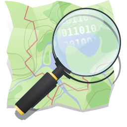

# Focus sur OpenStreetMap {#osm}

<div style="float: right">
</div>

[OpenStreetMap (OSM)](https://www.openstreetmap.org){target="_blank"} est un projet de cartographie participative qui a pour but de constituer une base de données géographiques libre à l'échelle mondiale. 
OpenStreetMap vous permet de voir, modifier et d'utiliser des données géographiques du monde entier. 

**Conditions d'utilisation**  

> OpenStreetMap est en données ouvertes : vous êtes libre de l’utiliser pour n’importe quel but tant que vous créditez OpenStreetMap et ses contributeurs. Si vous modifiez ou vous appuyez sur les données d’une façon quelconque, vous pouvez distribuer le résultat seulement suivant la même licence. (…)

**Contributeurs**   

> (…) Nos contributeurs incluent des cartographes enthousiastes, des professionnels du SIG, des ingénieurs qui font fonctionner les serveurs d’OSM, des humanitaires cartographiant les zones dévastées par une catastrophe et beaucoup d’autres. (…)
<br/>

[A propos d'OpenStreetMap](https://www.openstreetmap.org/about){target="_blank"} 

R propose une série de packages qui se basent sur OpenStreetMap.

Dans ce chapitre nous allons utiliser les packages suivants : 

```{r pkg_osm}
# packages CRAN
library(ggspatial)
library(leaflet)
library(mapview)
library(osmdata)
library(osmextract)
library(osrm)
library(sf)
library(tidyverse)
# packages Github
library(COGiter)      # remotes::install_github("MaelTheuliere/COGiter")
library(gouvdown)     # remotes::install_github("spyrales/gouvdown")

# Données
load("extdata/sirene.RData")
load("extdata/admin_express.RData")

```


## Afficher une carte interactive

Les deux principaux packages qui permettent d'afficher une carte interactive basée sur OSM sont `{leaflet}` et `{mapview}`, vus précédemment. 

   

`{leaflet}` utilise la libraire javascript Leaflet pour créer des cartes interactives. 

Site web de `{leaflet}` : [Leaflet for R](https://rstudio.github.io/leaflet/){target="_blank"}  

  

`{mapview}` s'appuie sur `{leaflet}` pour créer des cartes interactives, son utilisation est plus simple car les instructions sont très concises.

Site web de `{mapview}`: [`mapview`](https://r-spatial.github.io/mapview/){target="_blank"} 


## Importer les fonds de carte pour ggplot

Le package `{ggspatial}` permet de télécharger et d'afficher des fonds de cartes raster issu d'OSM grâce à la fonction `annotation_map_tile()`.  

```{r tuiles_ggspatial, fig.width=6, fig.height=6, eval=TRUE}

boul_44 <- filter(sirene44, APET700 == "1071C") %>% 
  select(SIREN, NOMEN_LONG)

ggplot(boul_44) +
  annotation_map_tile(type = "osm") +
  geom_sf() +
  theme_gouv_map()

```


## Importer des données OSM

### `{osmdata}`
 
Le package `{osmdata}` permet d'extraire des données vectorielles depuis OSM en utilisant l'API [Overpass turbo](https://wiki.openstreetmap.org/wiki/Overpass_turbo){target="_blank"}. 


[Site web du package `osmdata`](https://docs.ropensci.org/osmdata/)

On développe ici un exemple dans lequel on extrait les pistes cyclables sur Nantes Métropole. 

On commence par définir la bbox de requête, au CRS 4326.

```{r osmdata, eval=TRUE}

# Sélection de l'emprise de la requête, 
nantes_metro <- epci_geo %>% 
  filter(NOM_EPCI == "Nantes Métropole") %>% 
  st_transform(4326)

# Définition d'une bounding box de requête
q <- opq(bbox = st_bbox(nantes_metro, 4326))

# Extraction des pistes cyclables
req <- add_osm_feature(opq = q, key = 'highway', value = "cycleway")
res <- osmdata_sf(req)

# Reduction du resultats 
# (les points composant les polygones sont supprimés)
res <- unique_osmdata(res)$osm_lines
mapview(res)
```
L'API comprend des limites : l'emprise de la surface d'interrogation et le nombre de requêtes envoyées par jour ne sont pas infinis.

Site web d'`{osmdata}` : [`osmdata`](https://docs.ropensci.org/osmdata/){target="_blank"} 


### `osmextract`

 
Le package `{osmextract}` permet d'extraire des données depuis une base de données OSM directement, sans limitation. 
Ce package permet de travailler sur des volumes de données très importants. 

Voici un exemple d'usage d'`{osmextract}`, toujours sur les pistes cyclables, qui va de la récupération des données au calcul d'indicateurs par commune. 
https://gitlab-forge.din.developpement-durable.gouv.fr/dreal-pdl/csd/sgbd_datamart/-/blob/master/data-raw/chargement_pistes_cyclables_osm.R

Site web d'`{osmextract}` : [`osmextract`](https://docs.ropensci.org/osmextract/){target="_blank"} 


## Calculer des itinéraires

 
Le package `{osrm}` sert d'interface entre R et le service de calcul d'itinéraire [OSRM](http://project-osrm.org/){target="_blank"} . 
Ce package permet de calculer des matrices de temps et de distances, des itinéraires routiers, des isochrones.   
Le package utilise par défaut le serveur de démonstration d'OSRM. 

En cas d'utilisation intensive [il est fortement recommandé d'utiliser sa propre instance d'OSRM (avec Docker)](https://github.com/Project-OSRM/osrm-backend#using-docker){target="_blank"}. 


### Calcul d'un itinéraire

La fonction `osrmRoute()` permet de calculer des itinéraires. 
On l'utilise ici pour un trajet du CVRH de Nantes à la gare SNCF. 
Le paramètre `osrm.profile` sert à indiquer le profil du voyageur : véhiculé ("car"), cycliste ("bike") ou piéton ("foot").  
Par défaut elle renvoie un objet géo, correspondant à l'itinéraire calculé. 

```{r osrmroute, fig.width = 3, fig.height = 5}

mes_adresses <- data.frame(services = c("CVRH Nantes", "Gare Nord Nantes"),
                           lat = c(47.22542, 47.217777),
                           long = c(-1.574013, -1.542315)) %>% 
  st_as_sf(coords = c("long", "lat"), crs = 4326) %>% 
  st_transform(3857)

mapview(mes_adresses)

trajet <- osrmRoute(src = mes_adresses[1,], dst = mes_adresses[2,], osrm.profile = "bike")
mapview(list(mes_adresses, trajet))

osrmRoute(src = mes_adresses[1,], dst = mes_adresses[2,], overview = FALSE, osrm.profile = "bike")

```
Le paramètre overview lorsqu'il est mis à FALSE, permet de récupérer la durée et la longueur de l'itinéraire.

### Calcul d'une matrice de temps
La fonction `osrmTable()` permet de calculer des matrices de distances ou de temps par la route. 

Dans cet exemple nous calculons une matrice de temps entre les 2 adresses et les restaurants de Nantes Métropole à pied. 

Préparons nos données :  
```{r osrmtable}
load("extdata/sirene.RData")
emprise_nantes <- COGiter::communes_geo %>% 
  filter(DEPCOM == "44109")

restaurants_nantes <- filter(sirene44, APET700 == "5610A")%>% 
  st_filter(emprise_nantes) %>% 
  st_transform(4326)
```

```{r osrmtable triche pour CI, include=FALSE}
load("extdata/matrice_duree_osm.RData")
```

Calculons la matrice de distance entre les 2 adresses et les restaurants de Nantes :  

```{r osrmtable3, eval=FALSE}
mat <- osrmTable(src = mes_adresses,
                 dst = restaurants_nantes,
                 osrm.profile = "foot")
mat$durations[,1:5]
```

```{r osrmtable3, include=FALSE}
mat$durations[,1:5]
```

Quelle adresse possède une meilleurs accessibilité en temps aux restaurants ?  

```{r osrmtable4, eval=FALSE}
boxplot(t(mat$durations), cex.axis = .7)

```
